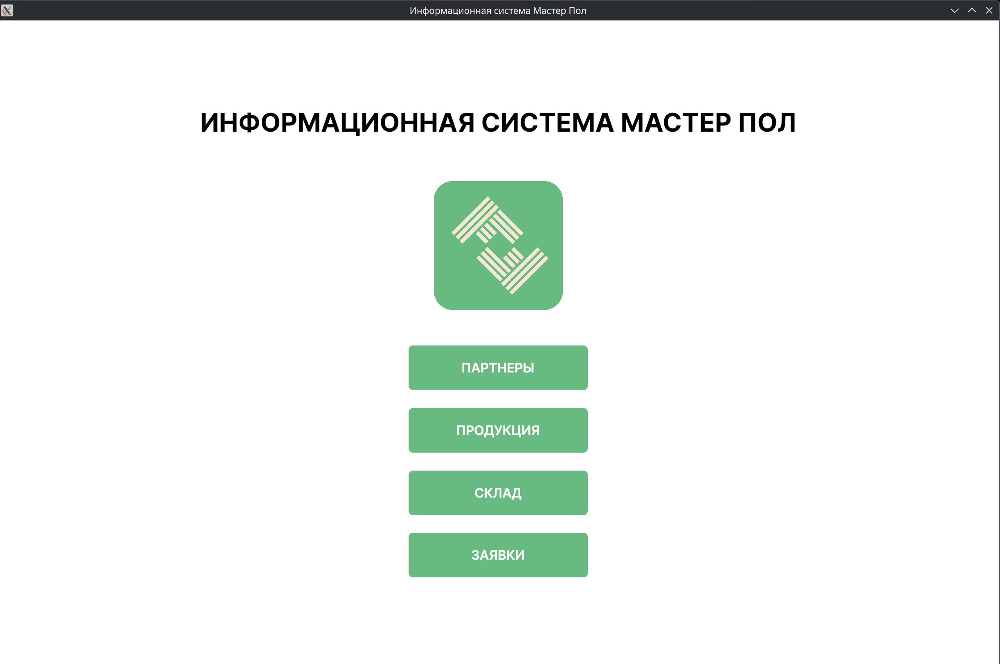
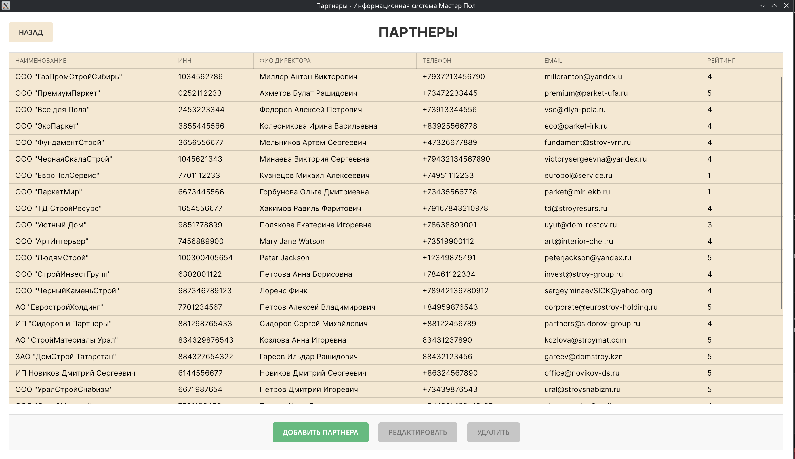
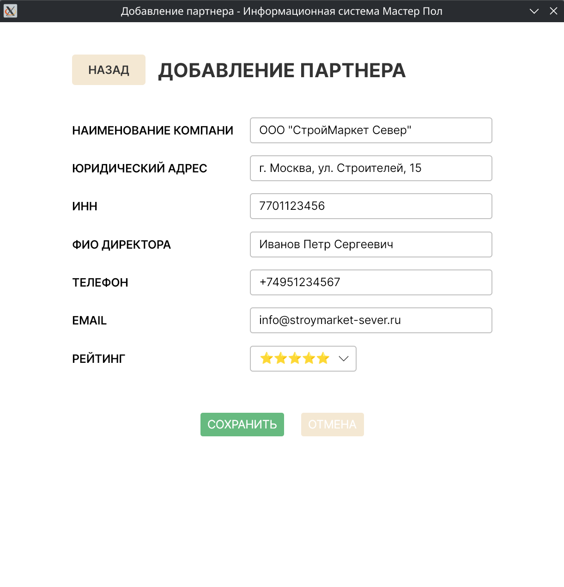
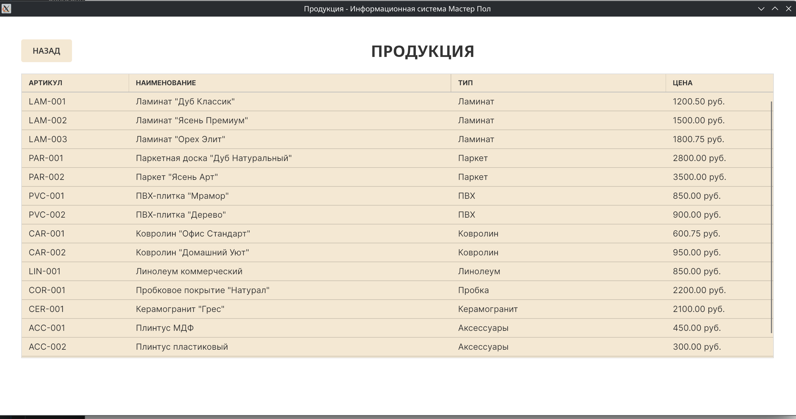
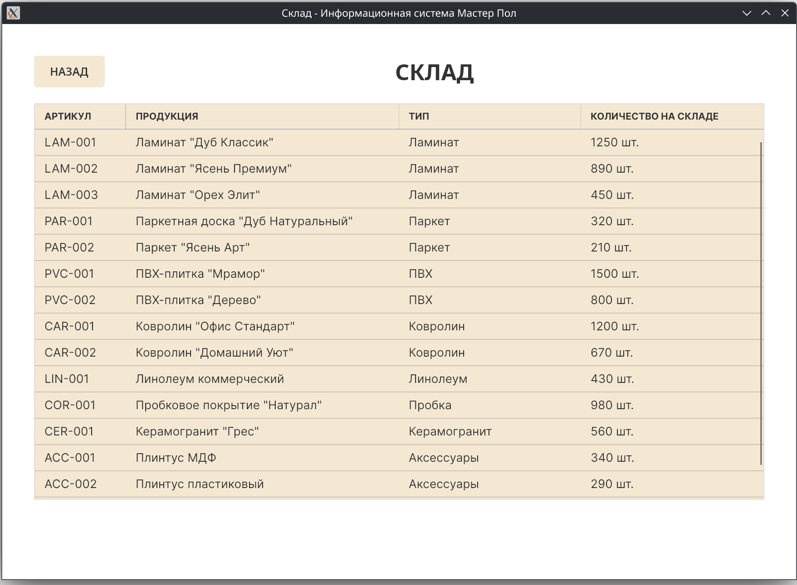
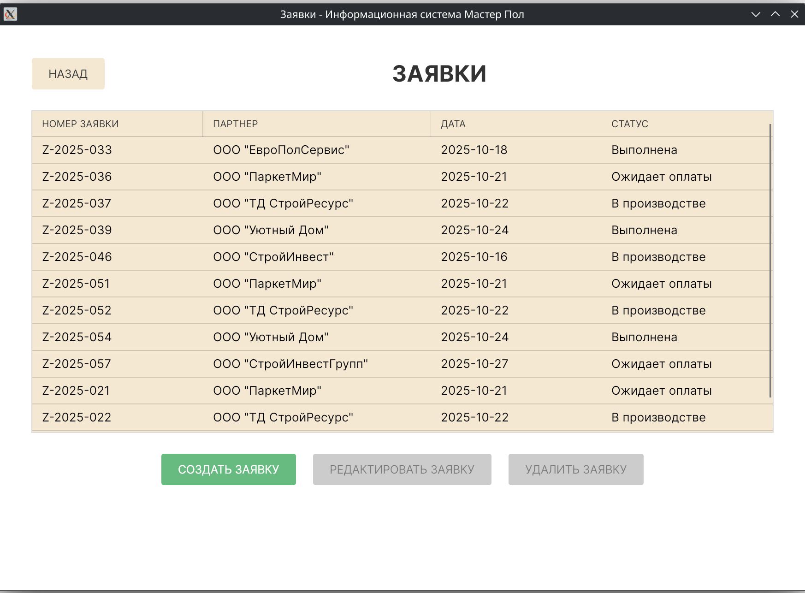
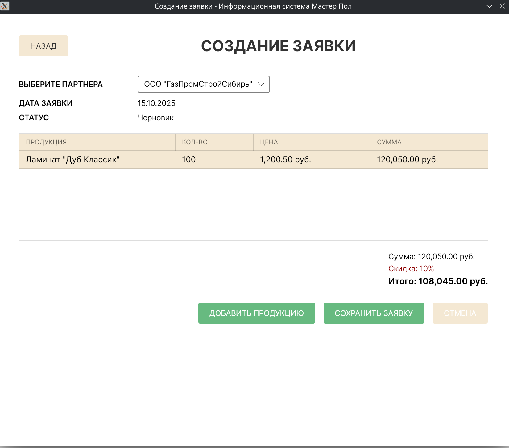
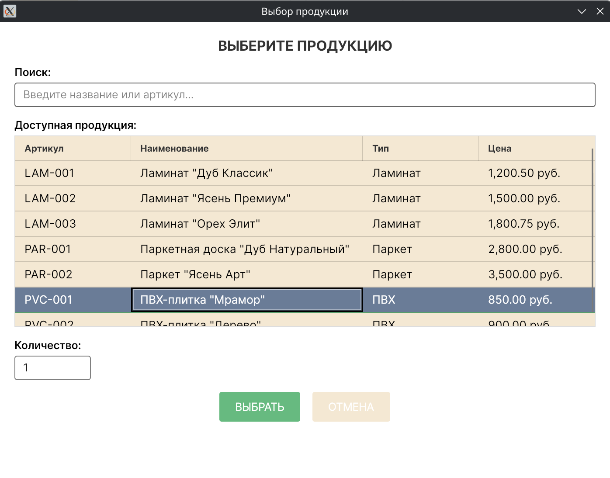
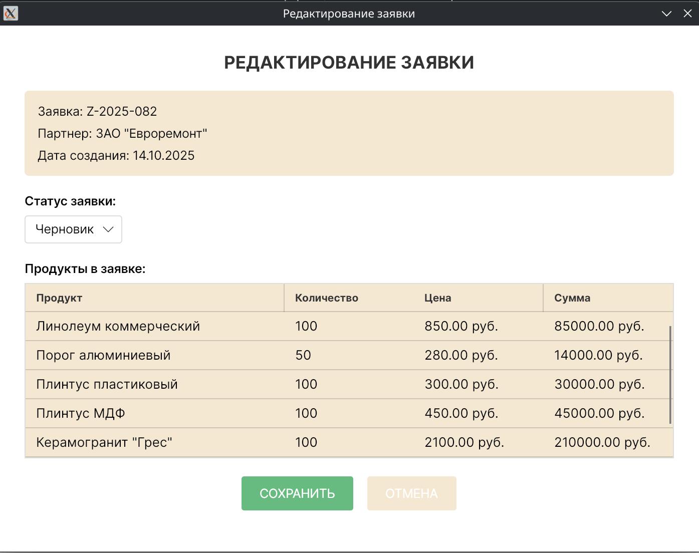

# Floors Manufacturing Management System

[](https://avaloniaui.net/)
[](https://dotnet.microsoft.com/download/dotnet/9.0)
[](https://docs.microsoft.com/en-us/dotnet/csharp/whats-new/csharp-11)
[](https://www.postgresql.org/)

---

[🇷🇺 Русский](#ru) | [🇺🇸 English](#en)

<a id="ru"></a>

## 🇷🇺 Floors Manufacturing Management System: Управление производством

### **Содержание**

1.  [О проекте](#о-проекте)
2.  [Ключевые возможности](#ключевые-возможности)
3.  [Технологии](#технологии)
4.  [Установка и запуск](#установка-и-запуск)
5.  [Галерея скриншотов](#галерея-скриншотов)

### **О проекте**

**Floors Manufacturing Management System** — это кроссплатформенное desktop-приложение, разработанное для автоматизации и оптимизации бизнес-процессов в производственной компании "Мастер пол". Приложение охватывает полный цикл управления, от работы с клиентами до складского учета, и решает ключевую задачу — автоматизацию рутинных процессов производителя напольных покрытий.

### **Ключевые возможности**

- ⚙️ **CRM-система:** Управление данными партнеров, включая добавление, редактирование и удаление. Система проводит детальную валидацию бизнес-данных, таких как ИНН и email, для обеспечения их корректности.
- 📦 **Каталог продукции:** Централизованный каталог напольных покрытий с ценами, описаниями и функцией поиска.
- 💰 **Система заказов:** Создание и управление заявками. Приложение автоматически рассчитывает прогрессивные скидки (5% / 10% / 15%) в зависимости от суммы заказа.
- 📈 **Складской учет:** Отслеживание остатков продукции на складе в реальном времени, что обеспечивает прозрачность и контроль.
- 📋 **Гибкий workflow:** Заказы проходят через многоступенчатую систему статусов: `Черновик` → `В обработке` → `Выполнена`, что позволяет контролировать каждый этап выполнения.

### **Технологии**

- **Frontend:** Avalonia UI (кроссплатформенный desktop фреймворк), XAML, MVVM (CommunityToolkit.MVVM).
- **Backend:** .NET 9.0, C# 11, Entity Framework Core (ORM).
- **База данных:** PostgreSQL, Npgsql (провайдер).
- **Архитектура:** **MVVM архитектура** с четким разделением на слои (Views/ViewModels/Services/Models/Data), **Внедрение зависимостей** для управления зависимостями, **Событийно-ориентированная коммуникация** для межмодульного взаимодействия.

---

### **Установка и запуск**

#### **Предварительные требования**

- [.NET 9.0 SDK](https://dotnet.microsoft.com/download/dotnet/9.0)
- [PostgreSQL 16+](https://www.postgresql.org/download/)
- [Git](https://git-scm.com/)

#### **Пошаговая инструкция**

1.  **Клонирование репозитория:**

    ```bash
    git clone https://github.com/RamenOfficialGovPatsy/Floors-Manufacturing-System.git
    cd Floors-Manufacturing-System
    ```

2.  **Настройка базы данных**

    Приложение использует **PostgreSQL** и **Entity Framework Core**. Вы можете настроить базу данных двумя способами:

    - **Способ 1: Использование миграций Entity Framework (рекомендуется)**
      Это самый простой способ. Убедитесь, что у вас установлен **.NET 9.0 SDK**.

      - Создайте новую базу данных в PostgreSQL (например, `master_floor_db`).
      - Обновите строку подключения в файле `AppDbContext.cs`.
      - Откройте терминал в корне проекта и примените миграции:
        ```bash
        dotnet ef database update
        ```
        Эта команда автоматически создаст все необходимые таблицы и связи в вашей базе данных.

    - **Способ 2: Ручной запуск SQL-скриптов**
      Если вы предпочитаете ручную настройку, используйте эти SQL-скрипты.

      - **Полная структура БД и связи:**

        ```sql
        -- Таблица Partners (Партнеры)
        CREATE TABLE partners (
          partner_id SERIAL PRIMARY KEY,
          type VARCHAR(50),
          name VARCHAR(255) NOT NULL,
          address TEXT,
          inn VARCHAR(20) NOT NULL,
          director_name VARCHAR(255),
          phone VARCHAR(50),
          email VARCHAR(255),
          logo_path VARCHAR(500),
          rating INTEGER
        );

        -- Таблица Managers (Менеджеры)
        CREATE TABLE managers (
          manager_id SERIAL PRIMARY KEY,
          full_name VARCHAR(255),
          email VARCHAR(255)
        );

        -- Таблица Products (Продукция)
        CREATE TABLE products (
          product_id SERIAL PRIMARY KEY,
          article VARCHAR(100) NOT NULL,
          type VARCHAR(100),
          name VARCHAR(255) NOT NULL,
          description TEXT,
          image_path VARCHAR(500),
          min_price_partner DECIMAL(10,2)
        );

        -- Таблица Warehouse (Склад)
        CREATE TABLE warehouse (
          warehouse_id SERIAL PRIMARY KEY,
          product_id INTEGER UNIQUE REFERENCES products(product_id), -- Связь один-к-одному
          quantity_on_hand INTEGER
        );

        -- Таблица Applications (Заявки)
        CREATE TABLE applications (
          application_id SERIAL PRIMARY KEY,
          partner_id INTEGER REFERENCES partners(partner_id), -- Связь многие-к-одному
          manager_id INTEGER REFERENCES managers(manager_id), -- Связь многие-к-одному
          date_created TIMESTAMP NOT NULL,
          status VARCHAR(100) NOT NULL
        );

        -- Таблица Application_items (Содержимое заявок)
        CREATE TABLE application_items (
          item_id SERIAL PRIMARY KEY,
          application_id INTEGER REFERENCES applications(application_id), -- Связь многие-к-одному
          product_id INTEGER REFERENCES products(product_id), -- Связь многие-к-одному
          quantity INTEGER NOT NULL
        );

        -- Таблица Sales_history (История продаж)
        CREATE TABLE sales_history (
          history_id SERIAL PRIMARY KEY,
          partner_id INTEGER REFERENCES partners(partner_id), -- Связь многие-к-одному
          product_id INTEGER REFERENCES products(product_id), -- Связь многие-к-одному
          quantity INTEGER,
          sale_date TIMESTAMP
        );
        ```

      - **Заполнение тестовыми данными:**

        ```sql
        -- Тестовые данные для всех таблиц
        INSERT INTO partners (type, name, address, inn, director_name, phone, email, rating) VALUES
        ('ООО', 'СтройМаркет Север', 'г. Москва, ул. Строителей, 15', '7701123456', 'Иванов Петр Сергеевич', '+7-495-123-45-67', 'info@stroymarket.ru', 5),
        ('ИП', 'ПолПрофи', 'г. Санкт-Петербург, пр. Просвещения, 28', '783456789012', 'Сидорова Анна Владимировна', '+7-812-234-56-78', 'sales@polprofi.ru', 4);

        INSERT INTO managers (full_name, email) VALUES
        ('Алексеев Олег Игоревич', 'alexeyev.o@masterpol.ru'),
        ('Смирнова Елена Павловна', 'smirnova.e@masterpol.ru');

        INSERT INTO products (article, type, name, description, min_price_partner) VALUES
        ('PARK-001', 'Паркет', 'Дуб натуральный', 'Натуральный дубовый паркет, толщина 15мм', 2500.00),
        ('LAM-002', 'Ламинат', 'Ламинат Premium Class', 'Влагостойкий ламинат 33 класса', 1800.00);

        INSERT INTO warehouse (product_id, quantity_on_hand) VALUES
        (1, 1500),
        (2, 2500);

        INSERT INTO applications (partner_id, manager_id, date_created, status) VALUES
        (1, 1, NOW(), 'В обработке'),
        (2, 2, NOW(), 'Выполнена');

        INSERT INTO application_items (application_id, product_id, quantity) VALUES
        (1, 1, 50),
        (1, 2, 75),
        (2, 1, 120);

        INSERT INTO sales_history (partner_id, product_id, quantity, sale_date) VALUES
        (1, 1, 50, NOW()),
        (2, 1, 100, NOW());
        ```

3.  **Сборка и запуск:**
    ```bash
    dotnet restore
    dotnet run
    ```
    Или запустите проект через Visual Studio (F5).

### **Галерея скриншотов**


_1. Главное меню приложения_


_2. Окно управления партнерами_


_3. Форма добавления партнера_


_4. Каталог продукции_


_5. Складские остатки_


_6. Список заявок_


_7. Создание заявки_


_8. Выбор продукции для заявки_


_9. Редактирование заявки_

---

<br>

<a id="en"></a>

## 🇺🇸 Floors Manufacturing Management System: Production Management

### **Table of Contents**

1.  [About the Project](#about-the-project)
2.  [Key Features](#key-features)
3.  [Technologies](#technologies)
4.  [Installation and Run](#installation-and-run)
5.  [Screenshots Gallery](#screenshots-gallery)

### **About the Project**

**Floors Manufacturing Management System** is a cross-platform desktop application designed to automate and optimize business processes for the "Master Floor" manufacturing company. The application covers the full management cycle, from client relations to warehouse inventory, solving the key challenge of automating routine tasks for a flooring manufacturer.

### **Key Features**

- ⚙️ **CRM System:** Manage partner data, including adding, editing, and deleting records. The system performs detailed validation of business data, such as TIN (Taxpayer Identification Number) and email, to ensure accuracy.
- 📦 **Product Catalog:** A centralized catalog of flooring products with prices, descriptions, and a search function.
- 💰 **Order System:** Create and manage orders. The application automatically calculates progressive discounts (5% / 10% / 15%) based on the order total.
- 📈 **Warehouse Inventory:** Real-time tracking of product stock, providing transparency and control.
- 📋 **Flexible Workflow:** Orders move through a multi-stage status system: `Draft` → `In Processing` → `Completed`, allowing for control over each stage of fulfillment.

### **Technologies**

- **Frontend:** Avalonia UI (cross-platform desktop framework), XAML, MVVM (CommunityToolkit.MVVM).
- **Backend:** .NET 9.0, C# 11, Entity Framework Core (ORM).
- **Database:** PostgreSQL, Npgsql (provider).
- **Architecture:** **MVVM architecture** with clear layer separation (Views/ViewModels/Services/Models/Data), **Dependency Injection** for managing dependencies, **Event-driven communication** for inter-module interaction.

---

### **Installation and Run**

#### **Prerequisites**

- [.NET 9.0 SDK](https://dotnet.microsoft.com/download/dotnet/9.0)
- [PostgreSQL 16+](https://www.postgresql.org/download/)
- [Git](https://git-scm.com/)

#### **Step-by-step Guide**

1.  **Clone the repository:**

    ```bash
    git clone https://github.com/RamenOfficialGovPatsy/Floors-Manufacturing-System.git
    cd Floors-Manufacturing-System
    ```

2.  **Database Setup**

    The application uses **PostgreSQL** and **Entity Framework Core**. You can set up the database in two ways:

    - **Option 1: Using Entity Framework Migrations (Recommended)**
      This is the easiest way. Make sure you have the **.NET 9.0 SDK** installed.

      - Create a new PostgreSQL database (e.g., `master_floor_db`).
      - Update the connection string in the `AppDbContext.cs` file.
      - Open a terminal in the project root and apply the migrations:
        ```bash
        dotnet ef database update
        ```
        This command will automatically create all the necessary tables and relationships in your database.

    - **Option 2: Manual SQL Script Execution**
      If you prefer a manual setup, use these SQL scripts.

      - **Full DB Structure and Relationships:**

        ```sql
        -- Partners Table
        CREATE TABLE partners (
          partner_id SERIAL PRIMARY KEY,
          type VARCHAR(50),
          name VARCHAR(255) NOT NULL,
          address TEXT,
          inn VARCHAR(20) NOT NULL,
          director_name VARCHAR(255),
          phone VARCHAR(50),
          email VARCHAR(255),
          logo_path VARCHAR(500),
          rating INTEGER
        );

        -- Managers Table
        CREATE TABLE managers (
          manager_id SERIAL PRIMARY KEY,
          full_name VARCHAR(255),
          email VARCHAR(255)
        );

        -- Products Table
        CREATE TABLE products (
          product_id SERIAL PRIMARY KEY,
          article VARCHAR(100) NOT NULL,
          type VARCHAR(100),
          name VARCHAR(255) NOT NULL,
          description TEXT,
          image_path VARCHAR(500),
          min_price_partner DECIMAL(10,2)
        );

        -- Warehouse Table
        CREATE TABLE warehouse (
          warehouse_id SERIAL PRIMARY KEY,
          product_id INTEGER UNIQUE REFERENCES products(product_id), -- One-to-one relationship
          quantity_on_hand INTEGER
        );

        -- Applications Table
        CREATE TABLE applications (
          application_id SERIAL PRIMARY KEY,
          partner_id INTEGER REFERENCES partners(partner_id), -- Many-to-one relationship
          manager_id INTEGER REFERENCES managers(manager_id), -- Many-to-one relationship
          date_created TIMESTAMP NOT NULL,
          status VARCHAR(100) NOT NULL
        );

        -- Application_items Table
        CREATE TABLE application_items (
          item_id SERIAL PRIMARY KEY,
          application_id INTEGER REFERENCES applications(application_id), -- Many-to-one relationship
          product_id INTEGER REFERENCES products(product_id), -- Many-to-one relationship
          quantity INTEGER NOT NULL
        );

        -- Sales_history Table
        CREATE TABLE sales_history (
          history_id SERIAL PRIMARY KEY,
          partner_id INTEGER REFERENCES partners(partner_id), -- Many-to-one relationship
          product_id INTEGER REFERENCES products(product_id), -- Many-to-one relationship
          quantity INTEGER,
          sale_date TIMESTAMP
        );
        ```

      - **Populate with Sample Data:**

        ```sql
        -- Sample data for all tables
        INSERT INTO partners (type, name, address, inn, director_name, phone, email, rating) VALUES
        ('LLC', 'StroyMarket Sever', 'Moscow, st. Stroiteley, 15', '7701123456', 'Petr S. Ivanov', '+7-495-123-45-67', 'info@stroymarket.ru', 5),
        ('IE', 'PolProfi', 'St. Petersburg, Prospekt Prosvescheniya, 28', '783456789012', 'Anna V. Sidorova', '+7-812-234-56-78', 'sales@polprofi.ru', 4);

        INSERT INTO managers (full_name, email) VALUES
        ('Oleg I. Alexeyev', 'alexeyev.o@masterfloor.ru'),
        ('Elena P. Smirnova', 'smirnova.e@masterfloor.ru');

        INSERT INTO products (article, type, name, description, min_price_partner) VALUES
        ('PARK-001', 'Parquet', 'Natural Oak', 'Natural oak parquet, 15mm thickness', 2500.00),
        ('LAM-002', 'Laminate', 'Laminate Premium Class', 'Moisture-resistant laminate, class 33', 1800.00);

        INSERT INTO warehouse (product_id, quantity_on_hand) VALUES
        (1, 1500),
        (2, 2500);

        INSERT INTO applications (partner_id, manager_id, date_created, status) VALUES
        (1, 1, NOW(), 'In processing'),
        (2, 2, NOW(), 'Completed');

        INSERT INTO application_items (application_id, product_id, quantity) VALUES
        (1, 1, 50),
        (1, 2, 75),
        (2, 1, 120);

        INSERT INTO sales_history (partner_id, product_id, quantity, sale_date) VALUES
        (1, 1, 50, NOW()),
        (2, 1, 100, NOW());
        ```

3.  **Build and Run:**
    ```bash
    dotnet restore
    dotnet run
    ```
    Alternatively, run the project from Visual Studio (F5).

### **Screenshots Gallery**


_1. Main Application Window_


_2. Partner Management Window_


_3. Add Partner Form_


_4. Product Catalog_


_5. Warehouse Stock_


_6. List of Applications_


_7. Create Application_


_8. Choose Product for Application_


_9. Edit Application_
